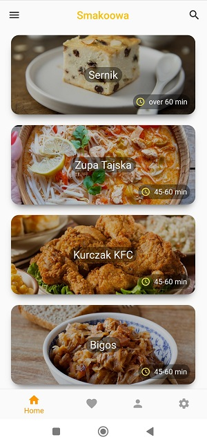
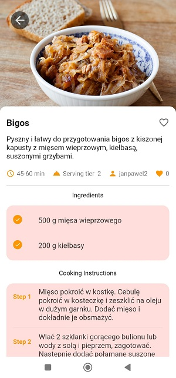

# Smakowa mobile 

Flutter project for culinary community. Enables users to discover, rate and create recipes. Cross-platform apliaction using custom Full-Rest-API. 

## Preview




## Requirements

To run and test this project locally, you need the following on your machine:

- Flutter SDK
- Dart
- Android Studio / VS Code
- Android emulator 
## Installation and Running

1. Clone the repository to your local machine
2. Navigate to the project directory
```
 cd YourApplicationName
 ```
 3. Install dependencies
```
flutter pub get
```
4. Connect your android emulator with code editor
5. Run the application
```
flutter run
```
`Note that this app needs external backend API to work properly.` Flutter project should now be accessible.
